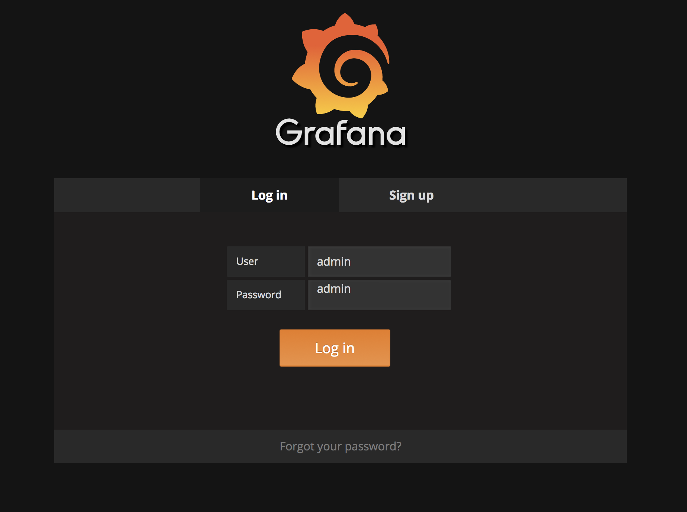
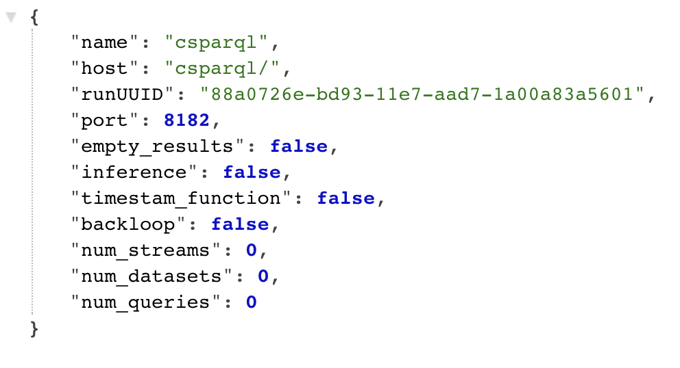

# Tutorial on How to Build a Stream Reasoning Application given at ISWC 2017
Url to the editable version of this document: http://bit.ly/2yFt86N

These are the notes taken during the hands on sessions of the How to Build a Stream Reasoning Application 2017

This was tested on a Mac, it should also work on any linux
Installing RSP Lab and run it locally (Tested on a Mac)

# Prerequisites:
- Git
- Python 2.7
- Docker and Docker-Compose
- Bash
- Port for the communication
   -- 8182 and 8183 RSP Endpoints
   -- 8283-8333 RSP engine web sockets out
   -- 5432 postgres
   -- 4000, 4001, 4040 and 4041 for the streams used in the tutorial

# Steps
- git clone -thttps://github.com/streamreasoning/rsplab.git ord download manually
- docker network create --attachable  demo
- cd rsplab

## Possible problems
- You don't have git
- You don’t have docker. Install it following [this guide](https://docs.docker.com/engine/installation/). 
- You don’t have python. If you have homebrew install it with brew install python. If you used it once and it is not working, update it with brew upgrade.

# Running The Streamer

## Steps
- cd rsplab/streamer/citybench
- ./start.sh -q query-streams/Q1.txt

## You know that you’re done if …

You open [http://localhost:4000/sgraph](http://localhost:4000/sgraph) and you get

 

This is the sGraph of the arhustrafficdata182955 data stream.

You open http://localhost:4001/sgraph and you get
  
 

This is the sGraph of the arhustrafficdata158505 data stream.

# Running the Collector

## Steps

- Go back to rsplab folder 
- cd collector
- ./start.sh

## You know that you’re done if …

You open [http://localhost:8888](http://localhost:8888)  and you get

- Open the folder and the **streamapp** subfolder
- Here you’ll see a list of ipython notebooks that we are going to use for our tutorial

You open [http://localhost:3000](http://localhost:3000) and you get

 

# Part 1 : Running the Consumer 

## Steps
- Go back to rsplab folder
- cd consumer
- ./start.sh --engine csparql -p 8182 
- Wait for the docker-compose to finish

## You know that you’re done if …

You go to [http://localhost:8182/engine](http://localhost:8182/engine) and you get

Running *docker ps* in a terminal you got something like

 

You open [http://localhost:3000](http://localhost:3000) and you get

 

You can monitor csparql engine performanct at [http://localhost:3000/dashboard/db/csparql?orgId=1](http://localhost:3000/dashboard/db/csparql?orgId=1)

## Let’s now work in the notebook

- An example of the notebook is available on [github](https://github.com/streamreasoning/rsplab/blob/tutorial/collector/lab/streamapp/StreamApp%20-%20Part%201%20-%20%20RDF%20Stream%20Processing%20with%20the%20CSPARQL%20engine.ipynb)
- If you are running the collector on you laptop [follow this link](http://localhost:8888/notebooks/work/streamapp/StreamApp%20-%20Part%202%20-%20Stream%20Reasoning%20Streams%20With%20Jasper.ipynb)

## Stopping the consumer 

- Go back to rsplab folder
- cd consumer
- ./stop.sh

# Part 2: Running the Consumer 

## Steps
- Go back to rsplab folder
- cd consumer
- ./start.sh --engine jasper -p 8183
- Wait for the docker-compose to finish

## You know that you’re done if …

You go to [http://localhost:8183/engine](http://localhost:8183/engine) and you get

Running *docker ps* in a terminal you got something like

## Let’s now work in the notebook

- An example of the notebook is available on [github](https://github.com/streamreasoning/rsplab/blob/tutorial/collector/lab/streamapp/Observing%20The%20Output%20-%20Part%202.ipynb)
- If you are running the collector on you laptop [follow this link](http://localhost:8888/notebooks/work/streamapp/StreamApp%20-%20Part%202%20-%20Stream%20Reasoning%20Streams%20With%20Jasper.ipynb)

You open [http://localhost:3000](http://localhost:3000) and you get

 

## Stopping the consumer 

- Go back to rsplab folder
- cd consumer
- ./stop.sh
